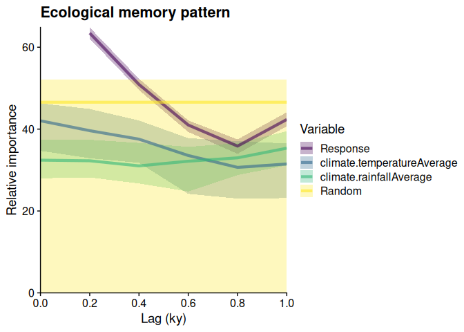

<!-- README.md is generated from README.Rmd. Please edit that file -->

# memoria

[](https://CRAN.R-project.org/package=memoria)
[](https://CRAN.R-project.org/package=memoria)

The **memoria** package quantifies ecological memory in long time-series
involving environmental drivers and biotic responses, including
palaeoecological datasets. It uses Random Forest models to measure the
relative importance of endogenous memory (effect of past response
values), exogenous memory (effect of past driver values), and concurrent
effects (synchronic driver influence).

## Installation

Install from CRAN:

``` r
install.packages("memoria")
```

Or the development version from GitHub:

``` r
# install.packages("devtools")
devtools::install_github("BlasBenito/memoria")
```

## Quick Example

This minimal example uses built-in data to demonstrate the core
workflow:

``` r
library(memoria)
library(ggplot2)

# Load pre-prepared lagged data
data(palaeodataLagged)

# Compute ecological memory pattern
memory_output <- computeMemory(
  lagged.data = palaeodataLagged,
  drivers = c("climate.temperatureAverage", "climate.rainfallAverage"),
  response = "Response",
  add.random = TRUE,
  random.mode = "autocorrelated",
  repetitions = 100
)

# Plot the memory pattern
plotMemory(memory_output)
```



The plot shows:

- **Violet curve**: Endogenous memory (effect of past pollen abundance)
- **Blue/green curves**: Exogenous memory (effect of past climate
  variables)
- **Yellow band**: Random benchmark for significance testing
- **Lag 0**: Concurrent effect of drivers

## Learn More

- **[Quick Start
  Guide](https://blasbenito.github.io/memoria/articles/quick_start.html)**:
  Full workflow from raw data to memory features
- **[Using
  memoria](https://blasbenito.github.io/memoria/articles/using_memoria.html)**:
  Detailed explanation of methods and theory
- **[Function
  Reference](https://blasbenito.github.io/memoria/reference/index.html)**:
  Documentation for all exported functions
