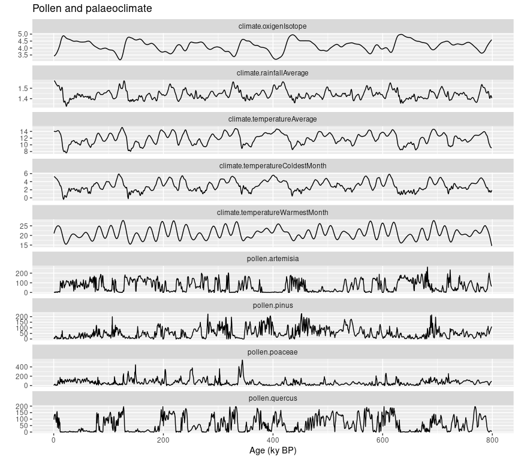
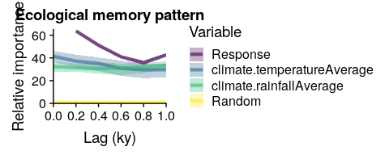
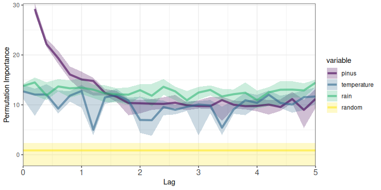

<!-- README.md is generated from README.Rmd. Please edit that file -->

# memoria

<!-- badges: start -->
[](https://CRAN.R-project.org/package=memoria)
[](https://CRAN.R-project.org/package=memoria)
[](https://github.com/blasbenito/memoria/actions/workflows/R-CMD-check.yaml)
<!-- badges: end -->

The **memoria** package quantifies ecological memory in long time-series
involving environmental drivers and biotic responses. It uses Random
Forest models to measure the relative importance of endogenous memory
(effect of past response values), exogenous memory (effect of past
driver values), and concurrent effects (synchronic driver influence).

## Installation

Install from CRAN:

``` r
install.packages("memoria")
```

Or the development version from GitHub:

``` r
devtools::install_github("BlasBenito/memoria")
```

## Quick Example

This minimal example uses built-in data to demonstrate the core
workflow.

``` r
library(memoria)
library(distantia)
library(dplyr)
```

### Example Data

The `palaeodata` dataset contains is a palaeoecological dataset with
pollen counts (non-integer because the data was interpolated to a
regular grid, see `mergePalaeoData()`) for several taxa and several
climate variables.

``` r
data(palaeodata)
dplyr::glimpse(palaeodata)
#> Rows: 3,993
#> Columns: 10
#> $ age                             <dbl> 0.5, 0.7, 0.9, 1.1, 1.3, 1.5, 1.7, 1.9…
#> $ pollen.pinus                    <dbl> 0.000000, 2.504311, 6.970560, 10.64129…
#> $ pollen.quercus                  <dbl> 95.58695, 109.43764, 120.11562, 127.74…
#> $ pollen.poaceae                  <dbl> 0.000000, 9.548974, 16.791644, 21.7550…
#> $ pollen.artemisia                <dbl> 0.0000000, 0.0000000, 0.6724734, 1.696…
#> $ climate.temperatureAverage      <dbl> 14.08241, 14.06364, 14.04636, 14.03058…
#> $ climate.rainfallAverage         <dbl> 1.570000, 1.570000, 1.570000, 1.570000…
#> $ climate.temperatureWarmestMonth <dbl> 21.04644, 21.25322, 21.45470, 21.65086…
#> $ climate.temperatureColdestMonth <dbl> 5.249096, 5.240348, 5.229598, 5.216903…
#> $ climate.oxigenIsotope           <dbl> 3.425792, 3.428361, 3.431511, 3.435238…
```

For this example we select one of the plant species and two climate
variables.

``` r
#subset variables of interest
df <- palaeodata |> 
  dplyr::transmute(
    pinus = pollen.pinus,
    temperature = climate.temperatureAverage,
    rain = climate.rainfallAverage,
    time = age
  )

#time series plot
df |>  
  distantia::tsl_init(
  time_column = "time"
) |> 
  distantia::tsl_plot(
    ylim = "relative",
    guide = FALSE
  )
```


Notice that in the plot above, time, in thousands of years before
present, goes from right (oldest) to left (newest).

The next step requires building a lagged version of the data, in which
each value of the response and the predictors (drivers) is matched with
previous values.

``` r
#lag in ka
#"by" must match the resolution of df
lags <- seq(from = 0.2, to = 5, by = 0.2)

df_lags <- memoria::prepareLaggedData(
  input.data = df,
  response = "pinus",
  drivers = c(
    "temperature", 
    "rain"
    ),
  time = "time",
  oldest.sample = "last",
  lags = lags
)

dplyr::glimpse(df_lags)
#> Rows: 3,968
#> Columns: 79
#> $ pinus__0         <dbl> 0.000000, 2.504311, 6.970560, 10.641292, 13.387639, 1…
#> $ pinus__0.2       <dbl> 2.504311, 6.970560, 10.641292, 13.387639, 15.023729, …
#> $ pinus__0.4       <dbl> 6.970560, 10.641292, 13.387639, 15.023729, 15.619855,…
#> $ pinus__0.6       <dbl> 10.6412923, 13.3876394, 15.0237290, 15.6198546, 14.51…
#> $ pinus__0.8       <dbl> 13.3876394, 15.0237290, 15.6198546, 14.5163833, 10.88…
#> $ pinus__1         <dbl> 15.0237290, 15.6198546, 14.5163833, 10.8839100, 5.995…
#> $ pinus__1.2       <dbl> 15.6198546, 14.5163833, 10.8839100, 5.9950859, 11.775…
#> $ pinus__1.4       <dbl> 14.5163833, 10.8839100, 5.9950859, 11.7753734, 15.743…
#> $ pinus__1.6       <dbl> 10.8839100, 5.9950859, 11.7753734, 15.7433291, 16.595…
#> $ pinus__1.8       <dbl> 5.9950859, 11.7753734, 15.7433291, 16.5953322, 17.491…
#> $ pinus__2         <dbl> 11.7753734, 15.7433291, 16.5953322, 17.4914659, 18.53…
#> $ pinus__2.2       <dbl> 15.7433291, 16.5953322, 17.4914659, 18.5317822, 21.75…
#> $ pinus__2.4       <dbl> 16.5953322, 17.4914659, 18.5317822, 21.7547684, 26.94…
#> $ pinus__2.6       <dbl> 17.4914659, 18.5317822, 21.7547684, 26.9425866, 21.94…
#> $ pinus__2.8       <dbl> 18.5317822, 21.7547684, 26.9425866, 21.9470415, 17.88…
#> $ pinus__3         <dbl> 21.7547684, 26.9425866, 21.9470415, 17.8845479, 18.24…
#> $ pinus__3.2       <dbl> 26.9425866, 21.9470415, 17.8845479, 18.2428705, 19.10…
#> $ pinus__3.4       <dbl> 21.9470415, 17.8845479, 18.2428705, 19.1090245, 21.62…
#> $ pinus__3.6       <dbl> 17.8845479, 18.2428705, 19.1090245, 21.6279072, 21.90…
#> $ pinus__3.8       <dbl> 18.2428705, 19.1090245, 21.6279072, 21.9079992, 21.36…
#> $ pinus__4         <dbl> 19.1090245, 21.6279072, 21.9079992, 21.3638099, 22.74…
#> $ pinus__4.2       <dbl> 21.6279072, 21.9079992, 21.3638099, 22.7459342, 22.24…
#> $ pinus__4.4       <dbl> 21.9079992, 21.3638099, 22.7459342, 22.2438480, 13.04…
#> $ pinus__4.6       <dbl> 21.3638099, 22.7459342, 22.2438480, 13.0423754, 6.967…
#> $ pinus__4.8       <dbl> 22.7459342, 22.2438480, 13.0423754, 6.9679862, 0.5656…
#> $ pinus__5         <dbl> 22.2438480, 13.0423754, 6.9679862, 0.5656565, 0.00000…
#> $ temperature__0   <dbl> 14.08241, 14.06364, 14.04636, 14.03058, 14.01631, 14.…
#> $ temperature__0.2 <dbl> 14.06364, 14.04636, 14.03058, 14.01631, 14.00359, 13.…
#> $ temperature__0.4 <dbl> 14.04636, 14.03058, 14.01631, 14.00359, 13.99243, 13.…
#> $ temperature__0.6 <dbl> 14.03058, 14.01631, 14.00359, 13.99243, 13.98284, 13.…
#> $ temperature__0.8 <dbl> 14.01631, 14.00359, 13.99243, 13.98284, 13.97485, 13.…
#> $ temperature__1   <dbl> 14.00359, 13.99243, 13.98284, 13.97485, 13.96844, 13.…
#> $ temperature__1.2 <dbl> 13.99243, 13.98284, 13.97485, 13.96844, 13.96361, 13.…
#> $ temperature__1.4 <dbl> 13.98284, 13.97485, 13.96844, 13.96361, 13.96034, 13.…
#> $ temperature__1.6 <dbl> 13.97485, 13.96844, 13.96361, 13.96034, 13.95861, 13.…
#> $ temperature__1.8 <dbl> 13.96844, 13.96361, 13.96034, 13.95861, 13.95838, 13.…
#> $ temperature__2   <dbl> 13.96361, 13.96034, 13.95861, 13.95838, 13.95961, 13.…
#> $ temperature__2.2 <dbl> 13.96034, 13.95861, 13.95838, 13.95961, 13.96222, 13.…
#> $ temperature__2.4 <dbl> 13.95861, 13.95838, 13.95961, 13.96222, 13.96616, 13.…
#> $ temperature__2.6 <dbl> 13.95838, 13.95961, 13.96222, 13.96616, 13.97136, 13.…
#> $ temperature__2.8 <dbl> 13.95961, 13.96222, 13.96616, 13.97136, 13.97776, 13.…
#> $ temperature__3   <dbl> 13.96222, 13.96616, 13.97136, 13.97776, 13.98544, 13.…
#> $ temperature__3.2 <dbl> 13.96616, 13.97136, 13.97776, 13.98544, 13.99476, 14.…
#> $ temperature__3.4 <dbl> 13.97136, 13.97776, 13.98544, 13.99476, 14.00663, 14.…
#> $ temperature__3.6 <dbl> 13.97776, 13.98544, 13.99476, 14.00663, 14.02234, 14.…
#> $ temperature__3.8 <dbl> 13.98544, 13.99476, 14.00663, 14.02234, 14.04206, 14.…
#> $ temperature__4   <dbl> 13.99476, 14.00663, 14.02234, 14.04206, 14.06052, 14.…
#> $ temperature__4.2 <dbl> 14.00663, 14.02234, 14.04206, 14.06052, 14.07484, 14.…
#> $ temperature__4.4 <dbl> 14.02234, 14.04206, 14.06052, 14.07484, 14.09563, 14.…
#> $ temperature__4.6 <dbl> 14.04206, 14.06052, 14.07484, 14.09563, 14.11849, 14.…
#> $ temperature__4.8 <dbl> 14.06052, 14.07484, 14.09563, 14.11849, 14.13328, 14.…
#> $ temperature__5   <dbl> 14.07484, 14.09563, 14.11849, 14.13328, 14.14602, 14.…
#> $ rain__0          <dbl> 1.570000, 1.570000, 1.570000, 1.570000, 1.570000, 1.5…
#> $ rain__0.2        <dbl> 1.570000, 1.570000, 1.570000, 1.570000, 1.569424, 1.5…
#> $ rain__0.4        <dbl> 1.570000, 1.570000, 1.570000, 1.569424, 1.568048, 1.5…
#> $ rain__0.6        <dbl> 1.570000, 1.570000, 1.569424, 1.568048, 1.566565, 1.5…
#> $ rain__0.8        <dbl> 1.570000, 1.569424, 1.568048, 1.566565, 1.564987, 1.5…
#> $ rain__1          <dbl> 1.569424, 1.568048, 1.566565, 1.564987, 1.563325, 1.5…
#> $ rain__1.2        <dbl> 1.568048, 1.566565, 1.564987, 1.563325, 1.561583, 1.5…
#> $ rain__1.4        <dbl> 1.566565, 1.564987, 1.563325, 1.561583, 1.559766, 1.5…
#> $ rain__1.6        <dbl> 1.564987, 1.563325, 1.561583, 1.559766, 1.557871, 1.5…
#> $ rain__1.8        <dbl> 1.563325, 1.561583, 1.559766, 1.557871, 1.555890, 1.5…
#> $ rain__2          <dbl> 1.561583, 1.559766, 1.557871, 1.555890, 1.553790, 1.5…
#> $ rain__2.2        <dbl> 1.559766, 1.557871, 1.555890, 1.553790, 1.551496, 1.5…
#> $ rain__2.4        <dbl> 1.557871, 1.555890, 1.553790, 1.551496, 1.548835, 1.5…
#> $ rain__2.6        <dbl> 1.555890, 1.553790, 1.551496, 1.548835, 1.545830, 1.5…
#> $ rain__2.8        <dbl> 1.553790, 1.551496, 1.548835, 1.545830, 1.543771, 1.5…
#> $ rain__3          <dbl> 1.551496, 1.548835, 1.545830, 1.543771, 1.542352, 1.5…
#> $ rain__3.2        <dbl> 1.548835, 1.545830, 1.543771, 1.542352, 1.540789, 1.5…
#> $ rain__3.4        <dbl> 1.545830, 1.543771, 1.542352, 1.540789, 1.539005, 1.5…
#> $ rain__3.6        <dbl> 1.543771, 1.542352, 1.540789, 1.539005, 1.537520, 1.5…
#> $ rain__3.8        <dbl> 1.542352, 1.540789, 1.539005, 1.537520, 1.536191, 1.5…
#> $ rain__4          <dbl> 1.540789, 1.539005, 1.537520, 1.536191, 1.534481, 1.5…
#> $ rain__4.2        <dbl> 1.539005, 1.537520, 1.536191, 1.534481, 1.532796, 1.5…
#> $ rain__4.4        <dbl> 1.537520, 1.536191, 1.534481, 1.532796, 1.531755, 1.5…
#> $ rain__4.6        <dbl> 1.536191, 1.534481, 1.532796, 1.531755, 1.530777, 1.5…
#> $ rain__4.8        <dbl> 1.534481, 1.532796, 1.531755, 1.530777, 1.529046, 1.5…
#> $ rain__5          <dbl> 1.532796, 1.531755, 1.530777, 1.529046, 1.526795, 1.5…
#> $ time             <dbl> 0.5, 0.7, 0.9, 1.1, 1.3, 1.5, 1.7, 1.9, 2.1, 2.3, 2.5…
```

Lets plot three of these lags to see how they look:

``` r
distantia::zoo_plot(
  x = zoo::zoo(
    x = df_lags[1:100, c("pinus__0", "pinus__1", "pinus__2")],
    order.by = df_lags$time[1:100]
  ),
  xlab = "Age (ka BP)"
)
```



### Ecological Memory Analysis

The function `computeMemory()` trains Random Forest models with the
lagged data, using “pinus_0” as response, all other variables as
predictors, and a randomly generated variable for significance testing.

``` r
memory <- memoria::computeMemory(
  lagged.data = df_lags,
  repetitions = 10,
  num.threads = parallel::detectCores() - 1
)
```

The output object is a list with the response, the drivers, the
ecological memory analysis, the pseudo R-squared of the model
predictions, and the prediction stats.

``` r
names(memory)
#> [1] "response"   "drivers"    "memory"     "R2"         "prediction"
```

``` r
dplyr::glimpse(memory$memory)
#> Rows: 103
#> Columns: 6
#> $ median   <dbl> 29.213878, 22.221188, 19.170626, 15.819255, 15.140499, 14.630…
#> $ sd       <dbl> 0.6814508, 0.7123891, 1.1075636, 1.2512961, 1.4491825, 1.2420…
#> $ min      <dbl> 28.366586, 21.271992, 18.080622, 14.537870, 12.931494, 12.003…
#> $ max      <dbl> 30.08005, 23.26677, 20.97056, 17.90699, 16.48366, 15.42053, 1…
#> $ variable <fct> pinus, pinus, pinus, pinus, pinus, pinus, pinus, pinus, pinus…
#> $ lag      <dbl> 0.2, 0.4, 0.6, 0.8, 1.0, 1.2, 1.4, 1.6, 1.8, 2.0, 2.2, 2.4, 2…
```

The output of `computeMemory()` can be plotted with `plotMemory()`.

``` r
memoria::plotMemory(
  memory, 
  ribbon = TRUE
  )
```



The plot shows all ecological memory components of this dataset.

- **Endogenous memory** (“pinus” curve): shows the importance of the
  past pollen abundance in predicting current pollen abundance. The plot
  shows this is the most important ecological memory component in this
  dataset.

- **Significance test** (“random” curve): shows the importance of 10
  random autocorrelated variables to predict the response “pinus”. Helps
  to know when a given memory component explains the response better or
  worse than random.

- **Concurrent effect** (“temperature” and “rain” at lag 0): importance
  of the current driver values to predict the response. Both drivers are
  below the “random” curve, indicating that the concurrent effect is
  negligible in this dataset.

- **Exogenouos memory** (“temperature” and “rain” at lag \> 0):
  importance of the past driver values in explaining the current
  response values.

## Learn More

- **[Working with
  memoria](https://blasbenito.github.io/memoria/articles/working_with_memoria.html)**:
  Complete workflow from raw data to memory features
- **[Function
  Reference](https://blasbenito.github.io/memoria/reference/index.html)**:
  Documentation for all exported functions

## How to cite memoria

If you use **memoria** in your research, please cite both the package
and the associated paper:

**Paper:**

> Benito, B.M., Gil-Romera, G., & Birks, H.J.B. (2020). Ecological
> memory at millennial time-scales: the importance of data constraints,
> species longevity, and niche features. *Ecography*, 43(1), 1-10. doi:
> [10.1111/ecog.04772](https://doi.org/10.1111/ecog.04772)

**R package:**

> Benito, B.M. (2025). memoria: Quantifying Ecological Memory in
> Palaeoecological Datasets and Other Long Time-Series. R package
> version 1.1.0. doi:
> [10.32614/CRAN.package.memoria](https://doi.org/10.32614/CRAN.package.memoria)
