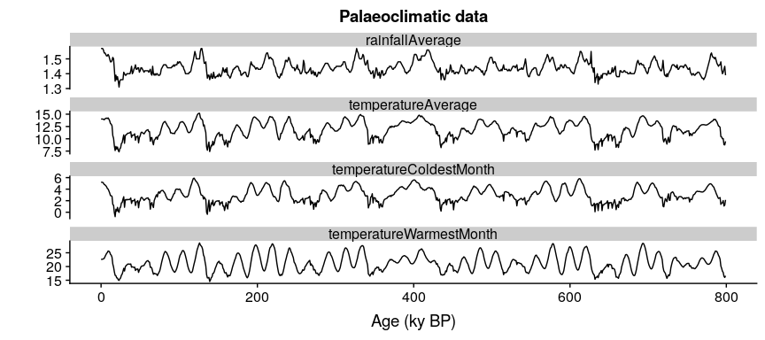
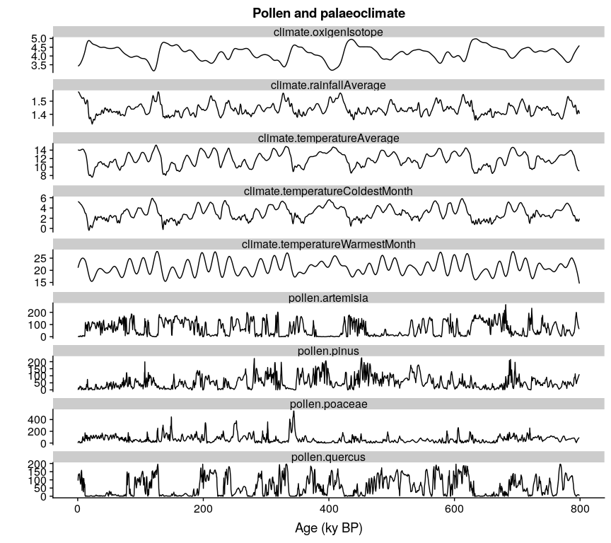
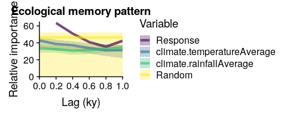

<!-- README.md is generated from README.Rmd. Please edit that file -->

# memoria

[](https://CRAN.R-project.org/package=memoria)
[](https://CRAN.R-project.org/package=memoria)

The goal of memoria is to provide the tools to quantify **ecological
memory** in long time-series involving environmental drivers and biotic
responses, including palaeoecological datasets.

Ecological memory has two main components: the *endogenous* component,
which represents the effect of antecedent values of the response on
itself, and the *exogenous* component, which represents the effect of
antecedent values of the driver or drivers on the current state of the
biotic response. Additionally, the *concurrent effect*, which represents
the synchronic effect of the environmental drivers on the response, is
also quantified.

The package *memoria* uses the fast implementation of Random Forest
available in the [ranger](https://CRAN.R-project.org/package=ranger)
package to fit a model of the form shown in **Equation 1**:

**Equation 1** (simplified from the one in the paper):
$$p_{t} = p_{t-1} +...+ p_{t-n} + d_{t} + d_{t-1} +...+ d_{t-n}$$

Where:

- $p$ is *Pollen*.
- $d$ is *Driver*.
- $t$ is the time of any given value of the response $p$.
- $t-1$ is the lag 1.
- $p_{t-1} +...+ p_{t-n}$ represents the endogenous component of
  ecological memory.
- $d_{t-1} +...+ d_{t-n}$ represents the exogenous component of
  ecological memory.
- $d_{t}$ represents the concurrent effect of the driver over the
  response.

Random Forest returns an importance score for each model term, and the
functions in *memoria* let the user plot the importance scores across
time lags for each ecological memory component, and to compute different
features of each memory component (length, strength, and dominance).

## Installation

You can install memoria from
[GitHub](https://github.com/BlasBenito/memoria) or
[CRAN](https://CRAN.R-project.org) with:

``` r
#from GitHub (development  version)
library(devtools)
install_github("blasbenito/memoria")

#from CRAN (not yet)
install.packages("memoria")
```

``` r
library(memoria)

#other useful libraries
library(ggplot2)
library(cowplot)
library(viridis)
library(tidyr)
library(kableExtra)
```

## Workflow

To work with *memoria*, the user needs a long time-series with at least
one environmental driver and one biotic response. The steps below assume
that the driver and the biotic response were sampled at different
temporal resolutions or depth intervals. If that is not the case, the
workflow starts at step **2**.

**1.** **Prepare data**. The function *mergePalaeoData* allows the user
to: 1) merge together environmental proxies/variables and biotic
responses sampled at different time resolutions; 2) reinterpolate the
data into a regular time grid using *loess*.

In this scenario we consider two datasets:

- *pollen*, with 639 samples dated in ky BP and four pollen types:
  Pinus, Quercus, Poaceae, and Artemisia.

- *climate*, with 800 samples dated in ky BP, and five climate
  variables: average temperature and rainfall, temperature of the
  warmest and coldest month, and oxygen isotope.

``` r
#loading and plotting pollen data
data(pollen)

#plotting the data
ggplot(data=gather(pollen, pollen.type, pollen.abundance, 2:5), 
       aes(x=age, 
           y=pollen.abundance, 
           group=pollen.type)) + 
  geom_line() + 
  facet_wrap("pollen.type", ncol=1, scales = "free_y") +
  xlab("Age (ky BP)") +
  ylab("Pollen counts") +
  ggtitle("Pollen dataset")
```


``` r
#loading and plotting climate data
data(climate)

#plotting the data
ggplot(data=gather(climate, variable, value, 2:5), 
       aes(x=age, 
           y=value, 
           group=variable)) + 
  geom_line() + 
  facet_wrap("variable", ncol=1, scales = "free_y") +
  xlab("Age (ky BP)") +
  ylab("") +
  ggtitle("Palaeoclimatic data")
```



The datasets are not aligned, and *pollen* is not sampled at regular
times, which makes analysis challenging. The code below fixes these
issues by merging the data into the same regular time grid through the
function *mergePalaeoData*. The function warns the user when the
interpolation factor (ratio between the original and interpolated
temporal resolutions) exceeds one order of magnitude. Please check the
help file of the function for further details.

``` r
#merging and interpolating into a
#regular time grid of 0.2 ky resolution
pollen.climate <- mergePalaeoData(
 datasets.list = list(
   pollen=pollen,
   climate=climate
 ),
 time.column = "age",
 interpolation.interval = 0.2
 )
#> Argument interpolation.interval is set to 0.2
#> The average temporal resolution of pollen is 1.27; you are incrementing data resolution by a factor of 6.35
#> The average temporal resolution of climate is 1; you are incrementing data resolution by a factor of 5

str(pollen.climate)
#> 'data.frame':    3993 obs. of  10 variables:
#>  $ age                            : num  0.5 0.7 0.9 1.1 1.3 1.5 1.7 1.9 2.1 2.3 ...
#>  $ pollen.pinus                   : num  0 2.5 6.97 10.64 13.39 ...
#>  $ pollen.quercus                 : num  95.6 109.4 120.1 127.7 132.6 ...
#>  $ pollen.poaceae                 : num  0 9.55 16.79 21.76 24.76 ...
#>  $ pollen.artemisia               : num  0 0 0.672 1.696 2.516 ...
#>  $ climate.temperatureAverage     : num  14.1 14.1 14 14 14 ...
#>  $ climate.rainfallAverage        : num  1.57 1.57 1.57 1.57 1.57 ...
#>  $ climate.temperatureWarmestMonth: num  21 21.3 21.5 21.7 21.8 ...
#>  $ climate.temperatureColdestMonth: num  5.25 5.24 5.23 5.22 5.2 ...
#>  $ climate.oxigenIsotope          : num  3.43 3.43 3.43 3.44 3.44 ...

#plotting the data
ggplot(data=gather(pollen.climate, variable, value, 2:10), 
       aes(x=age, 
           y=value, 
           group=variable)) + 
  geom_line() + 
  facet_wrap("variable", ncol=1, scales = "free_y") +
  xlab("Age (ky BP)") +
  ylab("") +
  ggtitle("Pollen and palaeoclimate")
```



**2.** **Organize the data in time lags**. To fit the model in
**Equation 1** it is required to select a response variable, a set of
drivers (or a single driver), and organize the data in lags, so every
sample in the response column is aligned with antecedent values of the
response and the environmental drivers for a given set of lags. The
function *prepareLaggedData* generates a dataframe with one column per
term in **Equation 1**. In this case, we use the pollen abundance of
Pinus as response variable, and average temperature and rainfall as
drivers/predictors.

``` r

pollen.climate.lagged <- prepareLaggedData(
 input.data = pollen.climate,
 response = "pollen.pinus",
 drivers = c("climate.temperatureAverage", "climate.rainfallAverage"),
 time = "age",
 oldest.sample = "last",
 lags = seq(0.2, 1, by=0.2),
 time.zoom=NULL,
 scale=FALSE
)
str(pollen.climate.lagged)
#> 'data.frame':    3988 obs. of  19 variables:
#>  $ Response_0                    : num  0 2.5 6.97 10.64 13.39 ...
#>  $ Response_0.2                  : num  2.5 6.97 10.64 13.39 15.02 ...
#>  $ Response_0.4                  : num  6.97 10.64 13.39 15.02 15.62 ...
#>  $ Response_0.6                  : num  10.6 13.4 15 15.6 14.5 ...
#>  $ Response_0.8                  : num  13.4 15 15.6 14.5 10.9 ...
#>  $ Response_1                    : num  15 15.6 14.5 10.9 6 ...
#>  $ climate.temperatureAverage_0  : num  14.1 14.1 14 14 14 ...
#>  $ climate.temperatureAverage_0.2: num  14.1 14 14 14 14 ...
#>  $ climate.temperatureAverage_0.4: num  14 14 14 14 14 ...
#>  $ climate.temperatureAverage_0.6: num  14 14 14 14 14 ...
#>  $ climate.temperatureAverage_0.8: num  14 14 14 14 14 ...
#>  $ climate.temperatureAverage_1  : num  14 14 14 14 14 ...
#>  $ climate.rainfallAverage_0     : num  1.57 1.57 1.57 1.57 1.57 ...
#>  $ climate.rainfallAverage_0.2   : num  1.57 1.57 1.57 1.57 1.57 ...
#>  $ climate.rainfallAverage_0.4   : num  1.57 1.57 1.57 1.57 1.57 ...
#>  $ climate.rainfallAverage_0.6   : num  1.57 1.57 1.57 1.57 1.57 ...
#>  $ climate.rainfallAverage_0.8   : num  1.57 1.57 1.57 1.57 1.56 ...
#>  $ climate.rainfallAverage_1     : num  1.57 1.57 1.57 1.56 1.56 ...
#>  $ time                          : num  0.5 0.7 0.9 1.1 1.3 1.5 1.7 1.9 2.1 2.3 ...
```

Pay attention to the *oldest.sample* argument. When set to “last” (as
above), the dataframe is assumed to be ordered by depth/age with the
oldest sample at the bottom, as in a typical palaeoecological dataset.
In this case, lag 1 of the first sample is the second sample. When set
to “first”, the oldest sample is assumed to be at the top, so lag 1 of
the second sample is the first sample.

Also note that: \* The response column is identified with the string
*Response_0* (as in “value of the response for the lag 0”). \* The
endogenous memory terms are identified with the pattern *Response\[0.2 -
1\]*, with the numbers indicating the lag (in the same units as the time
column). \* The exogenous memory terms are identified by the name of the
climatic variables followed by the lags between 0.2 and 1. \* The
concurrent effect is identified by the names of the climate variables
with the lag 0.

**3.** **Fit Random Forest model on the lagged data to assess ecological
memory**. The function *computeMemory* fits a Random Forest on the
lagged data following **Equation 1**. It does so by using the
implementation of Random Forest available in the
[ranger](https://CRAN.R-project.org/package=ranger) package. This
implementation supports parallel processing across all available cores,
considerably speeding up model fitting.

The goal of *computeMemory* is to measure the importance of every term
in **Equation 1**. Random Forest provides a robust measure of variable
importance that is insensitive to multicollinearity or temporal
autocorrelation in the input dataset. It is based on the loss of
accuracy when a given predictor is randomly permuted across a large
number of regression trees (please, see the vignette for further
information).

However, Random Forest does not provide a measure of significance,
making it difficult to assess whether a predictor’s importance is due to
chance. To address this, *computeMemory* adds a random term *r* to
**Equation 1**. This term is either a white-noise sequence (mode
*white.noise*) or a randomly generated autocorrelated time series (mode
*autocorrelated*). Both serve as a null benchmark, but the
*autocorrelated* mode provides more robust results.

The model is fitted repeatedly (see the *repetitions* argument in the
help of *computeMemory*), with the *r* term regenerated from a new
random seed on each repetition. After all repetitions are completed, the
0.05, 0.5, and 0.95 percentiles of the importance of each equation term
are computed and returned in the output dataframe.

The output can be easily plotted with the *plotMemory* function. The
example below is done with a low number of repetitions to reduce
runtime, but note that the recommended number of *repetitions* should be
higher (300 gives stable results for time series with around 500
samples).

``` r
#computing memory
memory.output <- computeMemory(
 lagged.data = pollen.climate.lagged,
 drivers = c("climate.temperatureAverage", 
             "climate.rainfallAverage"),
 response = "Response",
 add.random = TRUE,
 random.mode = "white.noise",
 repetitions = 100
)

#the output is a list with 4 slots

#the memory dataframe
head(memory.output$memory)
#>                                median        sd      min      max
#> Response_0.2                 63.65848 0.7682824 62.41392 64.86947
#> Response_0.4                 51.23290 0.7189726 49.95415 52.24058
#> Response_0.6                 40.88791 0.8803492 39.62307 42.32270
#> Response_0.8                 35.78362 1.0912701 34.11167 37.42975
#> Response_1                   42.92942 0.9165430 41.38402 44.03403
#> climate.temperatureAverage_0 41.97413 3.2183381 36.41167 45.97038
#>                                                Variable Lag
#> Response_0.2                                   Response 0.2
#> Response_0.4                                   Response 0.4
#> Response_0.6                                   Response 0.6
#> Response_0.8                                   Response 0.8
#> Response_1                                     Response 1.0
#> climate.temperatureAverage_0 climate.temperatureAverage 0.0

#predicted values
head(memory.output$prediction)
#>       median        sd       min       max
#> X1  4.856823 0.1176793  4.639347  5.028374
#> X2  5.594099 0.1084392  5.417588  5.764167
#> X3  7.600119 0.1327064  7.367217  7.810308
#> X4 11.104795 0.1268643 10.882982 11.276993
#> X5 13.504116 0.1457035 13.313671 13.701602
#> X6 14.259670 0.1088255 14.094937 14.442861

#pseudo R-squared of the predictions
head(memory.output$R2)
#> [1] 0.9876828 0.9877300 0.9876323 0.9877393 0.9876265 0.9877994

#VIF test on the input data
#VIF > 5 indicates significant multicollinearity
head(memory.output$multicollinearity)
#>                       variable         vif
#> 1                 Response_0.2    27.46575
#> 2                 Response_0.4    74.98629
#> 3                 Response_0.6    77.78521
#> 4                 Response_0.8    75.03215
#> 5                   Response_1    27.42287
#> 6 climate.temperatureAverage_0 15232.75139

#plotting the memory pattern 
plotMemory(memory.output)
#> Warning: Using `size` aesthetic for lines was deprecated in ggplot2 3.4.0.
#> ℹ Please use `linewidth` instead.
#> ℹ The deprecated feature was likely used in the memoria package.
#>   Please report the issue to the authors.
#> This warning is displayed once every 8 hours.
#> Call `lifecycle::last_lifecycle_warnings()` to see where this warning was
#> generated.
```

<div class="figure">


<p class="caption">
Ecological memory pattern of Pinus. The endogenous memory is represented
by the violet curve, the exogenous components (temperature and rainfall)
are represented by blue and green, and the random component is
represented in yellow. The lag 0 of temperature and rainfall represents
the concurrent effect.
</p>

</div>

<div class="figure">


<p class="caption">
Ecological memory pattern of Pinus. The endogenous memory is represented
by the violet curve, the exogenous components (temperature and rainfall)
are represented by blue and green, and the random component is
represented in yellow. The lag 0 of temperature and rainfall represents
the concurrent effect.
</p>

</div>

Below the model is repeated by using “autocorrelated” in the argument
*random.mode*.

``` r
#computing memory
memory.output.autocor <- computeMemory(
 lagged.data = pollen.climate.lagged,
 drivers = c("climate.temperatureAverage", 
             "climate.rainfallAverage"),
 response = "Response",
 add.random = TRUE,
 random.mode = "autocorrelated",
 repetitions = 100
)

#plotting the memory pattern 
plotMemory(memory.output.autocor)
```

<div class="figure">


<p class="caption">
Same as above, but observe that the yellow strip representing the random
term in the model has much higher values than when the random
time-series is generated without temporal autocorrelation, and therefore
the exogenous component seem to have importance scores that are below
the median of the random expectation.
</p>

</div>

<div class="figure">


<p class="caption">
Same as above, but observe that the yellow strip representing the random
term in the model has much higher values than when the random
time-series is generated without temporal autocorrelation, and therefore
the exogenous component seem to have importance scores that are below
the median of the random expectation.
</p>

</div>

Finally, the *features* of the ecological memory pattern can be
extracted. These features are:

- **memory strength**: Maximum difference in relative importance between
  each component (endogenous, exogenous, and concurrent) and the median
  of the random component. This is computed for exogenous, endogenous,
  and concurrent effect.

- **memory length**: Proportion of lags over which the importance of a
  memory component is above the median of the random component. This is
  only computed for endogenous and exogenous memory.

- **dominance**: Proportion of the lags above the median of the random
  term over which a memory component has a higher importance than the
  other component. This is only computed for endogenous and exogenous
  memory.

``` r
memory.features <- extractMemoryFeatures(
  memory.pattern = memory.output.autocor,
  exogenous.component = c(
  "climate.temperatureAverage",
  "climate.rainfallAverage"
  ),
  endogenous.component = "Response",
  sampling.subset = NULL,
  scale.strength = TRUE
  )

kable(memory.features)
```

| label | strength.endogenous | strength.exogenous | strength.concurrent | length.endogenous | length.exogenous | dominance.endogenous | dominance.exogenous |
|:------|--------------------:|-------------------:|--------------------:|------------------:|-----------------:|---------------------:|--------------------:|
| 1     |            17.72222 |                  0 |           -3.937447 |               0.4 |                0 |                  0.4 |                   0 |
