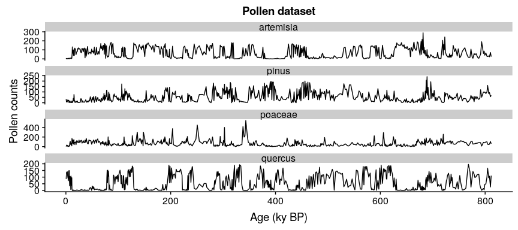

<!-- README.md is generated from README.Rmd. Please edit that file -->

# memoria

[](https://CRAN.R-project.org/package=memoria)
[](https://CRAN.R-project.org/package=memoria)

The goal of memoria is to provide the tools to quantify **ecological
memory** in long time-series involving environmental drivers and biotic
responses, including palaeoecological datasets.

Ecological memory has two main components: the *endogenous* component,
which represents the effect of antecedent values of the response on
itself, and *endogenous* component, which represents the effect of
antecedent values of the driver or drivers on the current state of the
biotic response. Additionally, the *concurrent effect*, which represents
the synchronic effect of the environmental drivers over the response is
measured. The functions in the package allow the user

The package *memoria* uses the fast implementation of Random Forest
available in the [ranger](https://CRAN.R-project.org/package=ranger)
package to fit a model of the form shown in **Equation 1**:

**Equation 1** (simplified from the one in the paper):
*p*<sub>*t*</sub> = *p*<sub>*t* − 1</sub> + ... + *p*<sub>*t* − *n*</sub> + *d*<sub>*t*</sub> + *d*<sub>*t* − 1</sub> + ... + *d*<sub>*t* − *n*</sub>

Where:

-   *p* is *Pollen*.
-   *d* is *Driver*.
-   *t* is the time of any given value of the response *p*.
-   *t* − 1 is the lag 1.
-   *p*<sub>*t* − 1</sub> + ... + *p*<sub>*t* − *n*</sub> represents the
    endogenous component of ecological memory.
-   *d*<sub>*t* − 1</sub> + ... + *d*<sub>*t* − *n*</sub> represents the
    exogenous component of ecological memory.
-   *d*<sub>*t*</sub> represents the concurrent effect of the driver
    over the response.

Random Forest returns an importance score for each model term, and the
functions in *memoria* let the user to plot the importance scores across
time lags for each ecological memory components, and to compute
different features of each memory component (length, strength, and
dominance).

## Installation

You can install the released version of memoria from
[GitHub](https://github.com/BlasBenito/memoria) or soon from
[CRAN](https://CRAN.R-project.org) with:

``` r
#from GitHub (development  version)
library(devtools)
install_github("blasbenito/memoria")

#from CRAN (not yet)
install.packages("memoria")
```

``` r
library(memoria)

#other useful libraries
library(ggplot2)
library(cowplot)
library(viridis)
library(tidyr)
library(kableExtra)
```

## Workflow

To work with the *memoria* package the user has to provide a long
time-series with at least one environmental driver and one biotic
response. The steps below assume that the driver and the biotic response
were taken at different temporal resolutions or depth intervals, but if
that is not the case, the actual workflow would start at point **2**.

**1.** **Prepare data**. The function *mergePalaeoData* allows the user
to: 1) merge together environmental proxies/variables and biotic
responses sampled at different time resolutions; 2) reinterpolate the
data into a regular time grid using *loess*.

In this scenario we consider two datasets:

-   *pollen*, with 639 samples dated in ky BP and four pollen types:
    Pinus, Quercus, Poaceae, and Artemisia.

-   *climate*, with 800 samples dated in ky BP, and five climate
    variables: average temperature and rainfall, temperature of the
    warmest and coldest month, and oxigen isotope.

``` r
#loading and plotting pollen data
data(pollen)

#plotting the data
ggplot(data=gather(pollen, pollen.type, pollen.abundance, 2:5), 
       aes(x=age, 
           y=pollen.abundance, 
           group=pollen.type)) + 
  geom_line() + 
  facet_wrap("pollen.type", ncol=1, scales = "free_y") +
  xlab("Age (ky BP)") +
  ylab("Pollen counts") +
  ggtitle("Pollen dataset")
```



``` r
#loading and plotting climate data
data(climate)

#plotting the data
ggplot(data=gather(climate, variable, value, 2:5), 
       aes(x=age, 
           y=value, 
           group=variable)) + 
  geom_line() + 
  facet_wrap("variable", ncol=1, scales = "free_y") +
  xlab("Age (ky BP)") +
  ylab("") +
  ggtitle("Palaeoclimatic data")
```


The datasets are not aligned, and *pollen* is not sampled at regular
times, which makes any kind of analysis challenging. The code below
fixes these issues by merging the data into the same regular time grid
through the function *mergePalaeoData*. The function warns the user when
the interpolation factor (difference between the original temporal
resolution of the data and the interpolated resolution) is higher than
one order of magnitude. Please, check the help file of the function to
better understand how it works.

``` r
#merging and interpolating into a
#regular time grid of 0.2 ky resolution
pollen.climate <- mergePalaeoData(
 datasets.list = list(
   pollen=pollen,
   climate=climate
 ),
 time.column = "age",
 interpolation.interval = 0.2
 )
#> Argument interpolation.interval is set to 0.2
#> The average temporal resolution of pollen is 1.27; you are incrementing data resolution by a factor of 6.35
#> The average temporal resolution of climate is 1; you are incrementing data resolution by a factor of 5

str(pollen.climate)
#> 'data.frame':    3993 obs. of  10 variables:
#>  $ age                            : num  0.5 0.7 0.9 1.1 1.3 1.5 1.7 1.9 2.1 2.3 ...
#>  $ pollen.pinus                   : num  0 2.5 6.97 10.64 13.39 ...
#>  $ pollen.quercus                 : num  95.6 109.4 120.1 127.7 132.6 ...
#>  $ pollen.poaceae                 : num  0 9.55 16.79 21.76 24.76 ...
#>  $ pollen.artemisia               : num  0 0 0.672 1.696 2.516 ...
#>  $ climate.temperatureAverage     : num  14.1 14.1 14 14 14 ...
#>  $ climate.rainfallAverage        : num  1.57 1.57 1.57 1.57 1.57 ...
#>  $ climate.temperatureWarmestMonth: num  21 21.3 21.5 21.7 21.8 ...
#>  $ climate.temperatureColdestMonth: num  5.25 5.24 5.23 5.22 5.2 ...
#>  $ climate.oxigenIsotope          : num  3.43 3.43 3.43 3.44 3.44 ...

#plotting the data
ggplot(data=gather(pollen.climate, variable, value, 2:10), 
       aes(x=age, 
           y=value, 
           group=variable)) + 
  geom_line() + 
  facet_wrap("variable", ncol=1, scales = "free_y") +
  xlab("Age (ky BP)") +
  ylab("") +
  ggtitle("Pollen and palaeoclimate")
```


**2.** **Organize the data in time lags**. To fit the model in
**Equation 1** it is required to select a response variable, a set of
drivers (or a single driver), and organize the data in lags, so every
sample in the response column is aligned with antecedent values of the
response and the environmental drivers for a given set of lags. The
function *prepareLaggedData* generates a dataframe with one column per
term in **Equation 1**. In this case, we use the pollen abundance of
Pinus as response varaible, and average temperature and rainfall as
drivers/predictors.

``` r
pollen.climate.lagged <- prepareLaggedData(
 input.data = pollen.climate,
 response = "pollen.pinus",
 drivers = c("climate.temperatureAverage", "climate.rainfallAverage"),
 time = "age",
 oldest.sample = "last",
 lags = seq(0.2, 1, by=0.2),
 time.zoom=NULL,
 scale=FALSE
)
str(pollen.climate.lagged)
#> 'data.frame':    3988 obs. of  19 variables:
#>  $ Response_0                    : num  0 2.5 6.97 10.64 13.39 ...
#>  $ Response_0.2                  : num  2.5 6.97 10.64 13.39 15.02 ...
#>  $ Response_0.4                  : num  6.97 10.64 13.39 15.02 15.62 ...
#>  $ Response_0.6                  : num  10.6 13.4 15 15.6 14.5 ...
#>  $ Response_0.8                  : num  13.4 15 15.6 14.5 10.9 ...
#>  $ Response_1                    : num  15 15.6 14.5 10.9 6 ...
#>  $ climate.temperatureAverage_0  : num  14.1 14.1 14 14 14 ...
#>  $ climate.temperatureAverage_0.2: num  14.1 14 14 14 14 ...
#>  $ climate.temperatureAverage_0.4: num  14 14 14 14 14 ...
#>  $ climate.temperatureAverage_0.6: num  14 14 14 14 14 ...
#>  $ climate.temperatureAverage_0.8: num  14 14 14 14 14 ...
#>  $ climate.temperatureAverage_1  : num  14 14 14 14 14 ...
#>  $ climate.rainfallAverage_0     : num  1.57 1.57 1.57 1.57 1.57 ...
#>  $ climate.rainfallAverage_0.2   : num  1.57 1.57 1.57 1.57 1.57 ...
#>  $ climate.rainfallAverage_0.4   : num  1.57 1.57 1.57 1.57 1.57 ...
#>  $ climate.rainfallAverage_0.6   : num  1.57 1.57 1.57 1.57 1.57 ...
#>  $ climate.rainfallAverage_0.8   : num  1.57 1.57 1.57 1.57 1.56 ...
#>  $ climate.rainfallAverage_1     : num  1.57 1.57 1.57 1.56 1.56 ...
#>  $ time                          : num  0.5 0.7 0.9 1.1 1.3 1.5 1.7 1.9 2.1 2.3 ...
```

Extra attention should be paid to the *oldest.sample* argument. When it
is set to “last”, as above, it assumes that the dataframe is ordered
(top to bottom) by depth/age, and therefore represents a
palaeoecological dataset. In this case, the lag 1 of the first sample is
the second sample. If it is set to “first”, it assumes that the first
sample defines the beginning of the time series. In such a case, the lag
1 of the second sample is the first sample.

Also note that: \* The resoponse column is identified with the string
*Response\_0* (as in “value of the response for the lag 0”). \* The
endogenous memory terms are identified with the pattern *Response\[0.2 -
1\]*, with the numbers indicating the lag (in the same units as the time
column). \* The exogenous memory terms are identified by the name of the
climatic variables followed by the lags between 0.2 and 1. \* The
concurrent effect is identified by the names of the climate variables
with the lag 0.

**3.** **Fit Random Forest model on the lagged data to assess ecological
memory**. The function *computeMemory* fits a Random Forest on the
lagged data following **Equation 1**. It does so by using the
implementation of Random Forest available in the
[ranger](https://CRAN.R-project.org/package=ranger) package. This is the
fastest Random Forest implementation available to date, and has the
ability to use every processor available in a computer, considerably
speeding up the model-fitting process.

The goal of *computeMemory* is to measure the importance of every term
in **Equation 1**. Random Forest provides a robust measure of variable
importance that is insensitive to multicollinearity or temporal
autocorrelation in the input dataset. It is based on the loss of
accuracy when a given predictor is randomly permuted across a large
number of regression trees (please, see the vignette for further
information).

However, Random Forest does not provide any measure of significance,
making it difficult to assess when the importance of a given predictor
is the result of chance. To solve this issue, *computeMemory* adds a new
term, named *r*, to **Equation 1**. This new term is either a totally
random sequence of numbers (mode *white.noise*) or a time series with a
temporal autocorrelation generated randomly (mode *autocorrelated*).
Both serve as a sort of null test, but using the *autocorrelated* mode
provides much more robust results.

The model is then repeated a number of times defined by the user (check
the *repetitions* argument in the help of the *computeMemory* function),
the *r* term is generated again with a different random seed on each
repetition, and after all iterations have been performed, the
percentiles 0.05, 0.5, and 0.95 of the importance of each equation term
are computed and provided in the output dataframe.

The output can be easily plotted with the *plotMemory* function. The
example below is done with a low number of repetitions to reduce
runtime, but note that the recommended number of *iterations* should be
higher (300 gives stable results for time series with around 500
samples).

``` r
#computing memory
memory.output <- computeMemory(
 lagged.data = pollen.climate.lagged,
 drivers = c("climate.temperatureAverage", 
             "climate.rainfallAverage"),
 response = "Response",
 add.random = TRUE,
 random.mode = "white.noise",
 repetitions = 100
)

#the output is a list with 4 slots

#the memory dataframe
head(memory.output$memory)
#>                                median        sd      min      max
#> Response_0.2                 63.65888 0.8364578 62.31013 65.15675
#> Response_0.4                 51.30263 0.7037971 50.22688 52.46269
#> Response_0.6                 40.81448 0.9309109 39.35845 42.29928
#> Response_0.8                 35.59843 1.0926171 33.75890 37.32521
#> Response_1                   42.74597 0.9461560 41.15155 43.93038
#> climate.temperatureAverage_0 41.87832 3.8001165 34.04238 45.63635
#>                                                Variable Lag
#> Response_0.2                                   Response 0.2
#> Response_0.4                                   Response 0.4
#> Response_0.6                                   Response 0.6
#> Response_0.8                                   Response 0.8
#> Response_1                                     Response 1.0
#> climate.temperatureAverage_0 climate.temperatureAverage 0.0

#predicted values
head(memory.output$prediction)
#>       median        sd       min       max
#> X1  4.828722 0.1353357  4.642276  5.079762
#> X2  5.604695 0.1451653  5.430713  5.883581
#> X3  7.624770 0.1486040  7.424911  7.869421
#> X4 11.116681 0.1221821 10.898352 11.315278
#> X5 13.469770 0.1326564 13.255327 13.680632
#> X6 14.264494 0.1059167 14.073003 14.434560

#pseudo R-squared of the predictions
head(memory.output$R2)
#> [1] 0.9877071 0.9877670 0.9877652 0.9876750 0.9877499 0.9876827

#VIF test on the input data
#VIF > 5 indicates significant multicollinearity
head(memory.output$multicollinearity)
#>                       variable         vif
#> 1                 Response_0.2    27.46575
#> 2                 Response_0.4    74.98629
#> 3                 Response_0.6    77.78521
#> 4                 Response_0.8    75.03215
#> 5                   Response_1    27.42287
#> 6 climate.temperatureAverage_0 15232.75139

#plotting the memory pattern 
plotMemory(memory.output)
```

<div class="figure">


<p class="caption">
Ecological memory pattern of Pinus. The intrinsic memory is represented
by the violet curve, the extrinsic components (temperature and rainfall)
are represented by blue and green, and the random component is
represented in yellow. The lag 0 of rainfall and precipitation
represents the concurrent effect.
</p>

</div>

Below the model is repeated by using “auatocorrelated” in the argument
*random.mode*.

``` r
#computing memory
memory.output.autocor <- computeMemory(
 lagged.data = pollen.climate.lagged,
 drivers = c("climate.temperatureAverage", 
             "climate.rainfallAverage"),
 response = "Response",
 add.random = TRUE,
 random.mode = "autocorrelated",
 repetitions = 100
)

#plotting the memory pattern 
plotMemory(memory.output.autocor)
```

<div class="figure">


<p class="caption">
Same as above, but observe that the yellow strip representing the random
term in the model has much higher values than when the random
time-series is generated without temporal autocorrelation, and therefore
the exogenous component seem to have importance scores that are below
the median of the random expectation.
</p>

</div>

Finally, the *features* of the ecological memory pattern can be
extracted. These features are:

-   **memory strength**: Maximum difference in relative importance
    between each component (endogenous, exogenous, and concurrent) and
    the median of the random component. This is computed for exogenous,
    endogenous, and concurrent effect.

-   **memory length**: Proportion of lags over which the importance of a
    memory component is above the median of the random component. This
    is only computed for endogenous and exogenous memory.

-   **dominance**: Proportion of the lags above the median of the random
    term over which a memory component has a higher importance than the
    other component. This is only computed for endogenous and exogenous
    memory.

``` r
memory.features <- extractMemoryFeatures(
  memory.pattern = memory.output.autocor,
  exogenous.component = c(
  "climate.temperatureAverage",
  "climate.rainfallAverage"
  ),
  endogenous.component = "Response",
  sampling.subset = NULL,
  scale.strength = TRUE
  )

kable(memory.features)
```

<table>
<thead>
<tr>
<th style="text-align:left;">
label
</th>
<th style="text-align:right;">
strength.endogenous
</th>
<th style="text-align:right;">
strength.exogenous
</th>
<th style="text-align:right;">
strength.concurrent
</th>
<th style="text-align:right;">
length.endogenous
</th>
<th style="text-align:right;">
length.exogenous
</th>
<th style="text-align:right;">
dominance.endogenous
</th>
<th style="text-align:right;">
dominance.exogenous
</th>
</tr>
</thead>
<tbody>
<tr>
<td style="text-align:left;">
1
</td>
<td style="text-align:right;">
18.20904
</td>
<td style="text-align:right;">
0
</td>
<td style="text-align:right;">
-2.561041
</td>
<td style="text-align:right;">
0.4
</td>
<td style="text-align:right;">
0
</td>
<td style="text-align:right;">
0.4
</td>
<td style="text-align:right;">
0
</td>
</tr>
</tbody>
</table>
