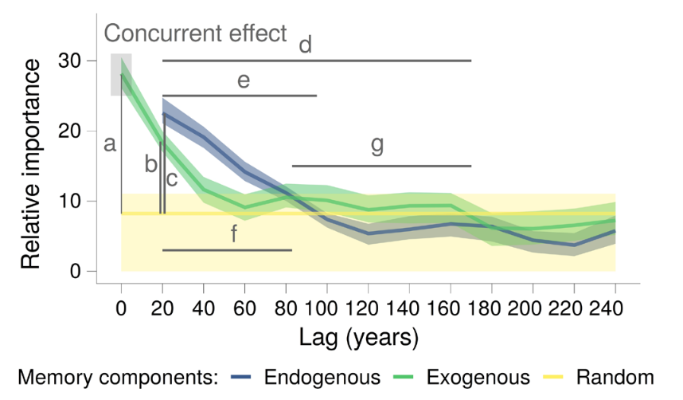
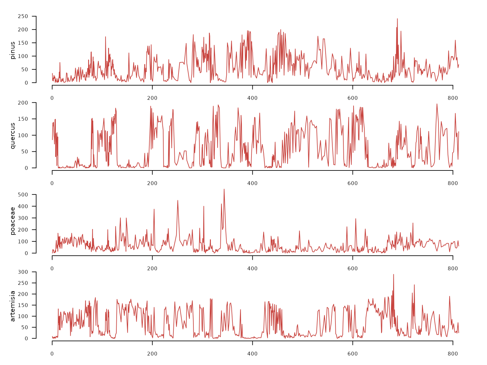
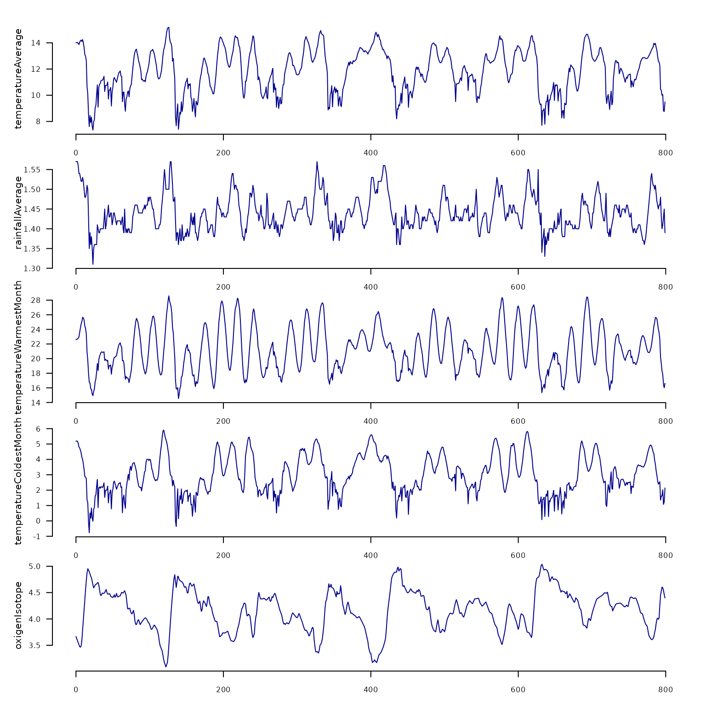
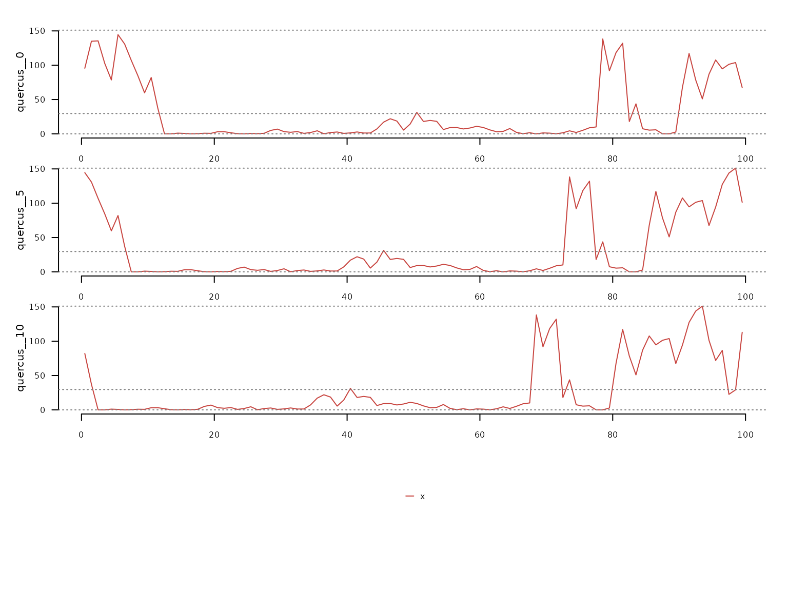
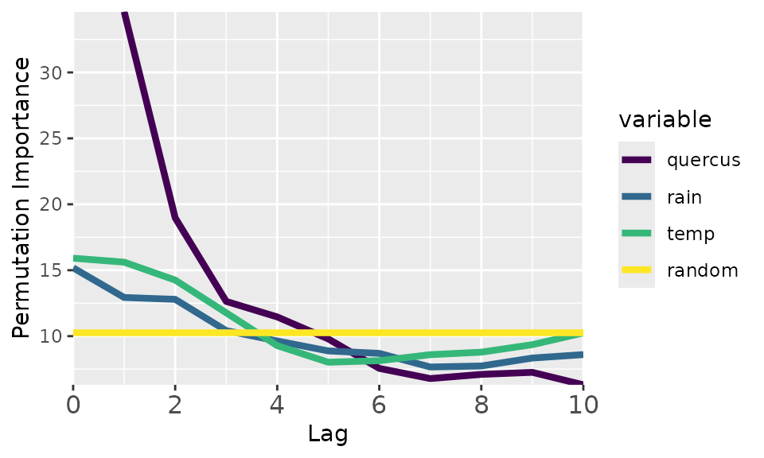

# Getting Started

This article walks through the complete `memoria` workflow for
quantifying ecological memory in time series data consisting of at least
one response and one predictor.

## Ecological Memory

The package `memoria` helps quantify how past and concurrent events
shape the state of a system. This concept is summarized in the figure
below:

 The blue and green curves
represent the values of a biotic response `y` and a driver `x` over
time. The vertical line `T` represents the *current* time, while
`T - lag` represents a previous time. The arrows represent *influence*,
as follows:

- **Endogenous memory**: is the effect of past `y` on present `y`.
- **Exogenous memory**: is the effect of past `x` on present `y`.
- **Concurrent effect**: is the effect of present `x` on present `y`.

To assess these effects, `memoria` generates the lagged data and trains
the model

$$y_{T} = y_{T - 1} + \ldots + y_{T - n} + x_{T} + x_{T - 1} + \ldots + x_{T - n} + r_{T}$$

Where:

- $y$ and $x$ are the response and the driver.
- $T$ is the “current” time, and $T - 1$ to $T - n$, are the time lags.
- $y_{T - 1} + \ldots + y_{T - n}$ represents the **endogenous memory**
  across lags.
- $x_{T - 1} + \ldots + x_{T - n}$ represents the **exogenous memory**
  across lags.
- $x_{T}$ represents the **concurrent effect**.
- $r_{T}$ is a random term used to assess statistical significance.

The ecological memory pattern is quantified using **permutation
importance** from Random Forest models. For each predictor, the
algorithm shuffles its values and measures the decrease in predictive
accuracy. Larger decreases indicate stronger influence on the response.

To visualize ecological memory, the package `memoria` plots permutation
importance scores across time lags.



Ecological Memory

Where:

- `a`: strength of the concurrent effect (highlighted by a grey box).
- `b` and `c`: strength of the exogenous and endogenous memory.
- `d` and `e`: length of the exogenous and endogenous memory.
- `f` and `g`: dominance across lags of the endogenous and exogenous
  memory.

The following sections demonstrate how to implement this workflow in R
using the `memoria` package.

## Setup

``` r
library(memoria)
library(distantia)
library(ggplot2)
library(dplyr)
```

## Workflow

The typical workflow involves time series with one response variable and
one or several drivers.

The package `memoria` has two example datasets, one with responses and
one with drivers:

- **pollen**: irregular time series with 639 samples and four pollen
  types (Pinus, Quercus, Poaceae, Artemisia).

``` r
data(pollen, package = "memoria")

pollen |> 
  distantia::tsl_init(
    time_column = "age"
  ) |> 
  distantia::tsl_plot(
    ylim = "relative",
    guide = FALSE
  )
```



- **climate**: regular time series with 800 samples taken every 1000
  years, with climate variables (temperature, rainfall, etc.)

``` r
data(climate, package = "memoria")

climate |> 
  distantia::tsl_init(
    time_column = "age"
  ) |> 
  distantia::tsl_plot(
    ylim = "relative",
    guide = FALSE,
    line_color = "blue4"
  )
```



### Align Datasets

The package `memoria` requires the input time series to be regular, but
`pollen` is irregular, with a range of time intervals between 0.32 and
6.475.

To homogenize both datasets, below we use linear interpolation with time
to align `pollen` with `climate`.

``` r
df <- memoria::alignTimeSeries(
  datasets.list = list(
    pollen = pollen,
    climate = climate
  ),
  time.column = "age",
  interpolation.interval = 1
)

nrow(df)
#> [1] 799
range(diff(df$age)) #1000 years
#> [1] 1 1
colnames(df)
#>  [1] "age"                             "pollen.pinus"                   
#>  [3] "pollen.quercus"                  "pollen.poaceae"                 
#>  [5] "pollen.artemisia"                "climate.temperatureAverage"     
#>  [7] "climate.rainfallAverage"         "climate.temperatureWarmestMonth"
#>  [9] "climate.temperatureColdestMonth" "climate.oxigenIsotope"
```

Now that the responses and the drivers are at the same resolution, we
just need to select the data we want to play with.

``` r
df <- df |> 
  dplyr::transmute(
    time = age,
    quercus = pollen.quercus,
    rain = climate.rainfallAverage,
    temp = climate.temperatureAverage
  )
```

### Create lagged data

The
[`lagTimeSeries()`](https://blasbenito.github.io/memoria/reference/lagTimeSeries.md)
function organizes data into the lag structure required by the model.
Each sample of the response is aligned with antecedent values of itself
and the drivers. In this case we use lags 1 to 10, which correspond with
1000 to 10000 years.

``` r
quercus_lags <- lagTimeSeries(
  input.data = df,
  response = "quercus",
  drivers = c("rain", "temp"),
  time = "time",
  oldest.sample = "last",
  lags = seq(from = 1, to = 10, by = 1)
)
```

**Note on `oldest.sample`:** Set to `"last"` when the oldest sample is
at the bottom of the dataframe (typical palaeoecological convention).
Set to `"first"` if the oldest sample is at the top.

The output columns follow a naming convention:

``` r
dplyr::glimpse(quercus_lags)
#> Rows: 789
#> Columns: 34
#> $ quercus__0  <dbl> 95.5869512, 134.9473077, 135.5032469, 102.7573460, 78.5362…
#> $ quercus__1  <dbl> 134.9473077, 135.5032469, 102.7573460, 78.5362180, 144.577…
#> $ quercus__2  <dbl> 135.5032469, 102.7573460, 78.5362180, 144.5770506, 130.868…
#> $ quercus__3  <dbl> 102.7573460, 78.5362180, 144.5770506, 130.8689767, 107.072…
#> $ quercus__4  <dbl> 78.5362180, 144.5770506, 130.8689767, 107.0723299, 84.5673…
#> $ quercus__5  <dbl> 144.5770506, 130.8689767, 107.0723299, 84.5673993, 59.7365…
#> $ quercus__6  <dbl> 130.8689767, 107.0723299, 84.5673993, 59.7365964, 82.09479…
#> $ quercus__7  <dbl> 107.0723299, 84.5673993, 59.7365964, 82.0947989, 37.212402…
#> $ quercus__8  <dbl> 84.5673993, 59.7365964, 82.0947989, 37.2124029, 0.0000000,…
#> $ quercus__9  <dbl> 59.7365964, 82.0947989, 37.2124029, 0.0000000, 0.0000000, …
#> $ quercus__10 <dbl> 82.0947989, 37.2124029, 0.0000000, 0.0000000, 1.0420467, 0…
#> $ rain__0     <dbl> 1.570000, 1.569424, 1.561583, 1.551496, 1.540789, 1.532796…
#> $ rain__1     <dbl> 1.569424, 1.561583, 1.551496, 1.540789, 1.532796, 1.525082…
#> $ rain__2     <dbl> 1.561583, 1.551496, 1.540789, 1.532796, 1.525082, 1.521579…
#> $ rain__3     <dbl> 1.551496, 1.540789, 1.532796, 1.525082, 1.521579, 1.524918…
#> $ rain__4     <dbl> 1.540789, 1.532796, 1.525082, 1.521579, 1.524918, 1.524046…
#> $ rain__5     <dbl> 1.532796, 1.525082, 1.521579, 1.524918, 1.524046, 1.509918…
#> $ rain__6     <dbl> 1.525082, 1.521579, 1.524918, 1.524046, 1.509918, 1.490164…
#> $ rain__7     <dbl> 1.521579, 1.524918, 1.524046, 1.509918, 1.490164, 1.479539…
#> $ rain__8     <dbl> 1.524918, 1.524046, 1.509918, 1.490164, 1.479539, 1.485871…
#> $ rain__9     <dbl> 1.524046, 1.509918, 1.490164, 1.479539, 1.485871, 1.503371…
#> $ rain__10    <dbl> 1.509918, 1.490164, 1.479539, 1.485871, 1.503371, 1.504261…
#> $ temp__0     <dbl> 14.082412, 14.003592, 13.963610, 13.962222, 13.994756, 14.…
#> $ temp__1     <dbl> 14.003592, 13.963610, 13.962222, 13.994756, 14.074843, 14.…
#> $ temp__2     <dbl> 13.963610, 13.962222, 13.994756, 14.074843, 14.159573, 14.…
#> $ temp__3     <dbl> 13.962222, 13.994756, 14.074843, 14.159573, 14.214738, 14.…
#> $ temp__4     <dbl> 13.994756, 14.074843, 14.159573, 14.214738, 14.203480, 14.…
#> $ temp__5     <dbl> 14.074843, 14.159573, 14.214738, 14.203480, 14.072493, 13.…
#> $ temp__6     <dbl> 14.159573, 14.214738, 14.203480, 14.072493, 13.798291, 13.…
#> $ temp__7     <dbl> 14.214738, 14.203480, 14.072493, 13.798291, 13.514943, 13.…
#> $ temp__8     <dbl> 14.203480, 14.072493, 13.798291, 13.514943, 13.153375, 12.…
#> $ temp__9     <dbl> 14.072493, 13.798291, 13.514943, 13.153375, 12.558464, 11.…
#> $ temp__10    <dbl> 13.798291, 13.514943, 13.153375, 12.558464, 11.686879, 10.…
#> $ time        <dbl> 0.5, 1.5, 2.5, 3.5, 4.5, 5.5, 6.5, 7.5, 8.5, 9.5, 10.5, 11…
```

``` r
quercus_lags |> 
  dplyr::select(
    quercus__0,
    quercus__5,
    quercus__10,
    time
  ) |> 
  dplyr::filter(
    time <= 100
  ) |>
  distantia::tsl_init(
    time_column = "time"
  ) |> 
  distantia::tsl_plot()
```



### Ecological Memory Analysis

The
[`computeMemory()`](https://blasbenito.github.io/memoria/reference/computeMemory.md)
function fits Random Forest models on the lagged data. It measures
variable importance using permutation, which is robust to
multicollinearity and temporal autocorrelation.

Two benchmark modes are available for significance testing:

- `"white.noise"`: Random values without temporal structure (faster)
- `"autocorrelated"`: Random walk with temporal structure (more
  conservative, **recommended**)

The model runs multiple times (`repetitions`), regenerating the random
term each time, then computes percentiles of importance scores.

``` r
quercus_memory <- memoria::computeMemory(
  lagged.data = quercus_lags,
  random.mode = "autocorrelated",
  repetitions = 100
)
```

We can visualize the results with
[`plotMemory()`](https://blasbenito.github.io/memoria/reference/plotMemory.md).

``` r
memoria::plotMemory(quercus_memory)
```



The plot shows all ecological memory components of this dataset.

- **Endogenous memory** (“quercus” curve): shows the importance of the
  past pollen abundance in predicting current pollen abundance. In this
  case, this is the most important memory component, with a lag of ~5000
  years.

- **Significance test** (“random” curve): shows the median importance
  scores of randomly generated variables. Defines a baseline helpful to
  know when a given memory component explains the response better (above
  the yellow line) or worse than random.

- **Concurrent effect** (“temp” and “rain” at lag 0): importance of the
  current driver values to predict the response. In this case, the
  *concurrent effect* is much weaker than the *endogenous memory*.

- **Exogenous memory** (“temp” and “rain” at lag \> 0): importance of
  the past driver values in explaining the current response values.
  According to the plot, temperature is the strongest component of the
  exogenous memory, with a lag of almost ~4000 years.

The
[`extractMemoryFeatures()`](https://blasbenito.github.io/memoria/reference/extractMemoryFeatures.md)
function transforms the plot results into quantitative features:

``` r
extractMemoryFeatures(
  memory.pattern = quercus_memory
) |> 
  dplyr::glimpse()
#> Rows: 1
#> Columns: 8
#> $ label                <chr> "quercus"
#> $ strength.endogenous  <dbl> 24.35066
#> $ strength.exogenous   <dbl> 5.351078
#> $ strength.concurrent  <dbl> 5.653404
#> $ length.endogenous    <dbl> 0.4
#> $ length.exogenous     <dbl> 0.3
#> $ dominance.endogenous <dbl> 0.4
#> $ dominance.exogenous  <dbl> 0
```

The output contains eight features organized in three groups:

The **strength** values (scaled to \[0, 1\] by default) measure the peak
importance of each memory component relative to the median of the random
baseline.

The **length** values (proportion in \[0, 1\]) measure how far into the
past each memory component remains above the random baseline. In this
case, the endogenous memory component is above the baseline for half of
the lags.

The **dominance** values (proportion in \[0, 1\]) measure whether
endogenous or exogenous memory prevails across significant lags. In this
case, the exogenous memory is never above the endogenous one, hence it
has zero dominance.

## Summary

The complete workflow:

1.  [`alignTimeSeries()`](https://blasbenito.github.io/memoria/reference/alignTimeSeries.md) -
    Align datasets with different resolutions.
2.  [`lagTimeSeries()`](https://blasbenito.github.io/memoria/reference/lagTimeSeries.md) -
    Create lag structure.
3.  [`computeMemory()`](https://blasbenito.github.io/memoria/reference/computeMemory.md) -
    Fit Random Forest and compute importance.
4.  [`plotMemory()`](https://blasbenito.github.io/memoria/reference/plotMemory.md) -
    Visualize the memory pattern.
5.  [`extractMemoryFeatures()`](https://blasbenito.github.io/memoria/reference/extractMemoryFeatures.md) -
    Quantify memory characteristics.
